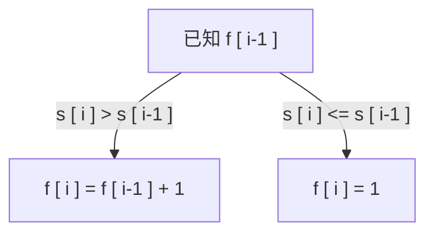

# AcWing-3748：递增子串


### 题目描述


#### 输入样例：

```
2
4
ABBC
6
ABACDA
```

#### 输出样例：

```
Case #1: 1 2 1 2
Case #2: 1 2 1 2 3 1
```

#### 样例解释

对于测试数据 1，在位置 1、2、3 和 4 处结束的最长严格递增子串分别为 `A`、`AB`、`B`、`BC`。

对于测试数据 2，在位置 1∼6 处结束的最长严格递增子串分别为 `A`、`AB`、`A`、`AC`、`ACD`、`A`。


### 算法求解

`dp`问题，假设字符串为`s`，使用`f[i]`来表示第`i`个字符末尾时，最长的子串长度。



以上子问题的关系构成动态规划，因此只需要遍历一遍即可，时间复杂度为`O(n)`

Code：

```c++
//
//  main.cpp
//  3748-递增子串
//
//  Created by MacBook Pro on 2023/8/10.
//

#include <iostream>
using namespace std;

int main() {
    int T;
    scanf("%d",&T);
    for(int cases=1;cases<=T;cases++){
        int n;
        string s;
        cin>>n>>s;
        int bef = 0;
        printf("Case #%d:",cases);
        for(int i=0;i<n;i++){
            if(i>0 && s[i]>s[i-1]){
                printf(" %d",++bef);
            }
            else{
                printf(" %d",1);
                bef = 1;
            }
            
        }
        printf("\n");
    }
}

```


