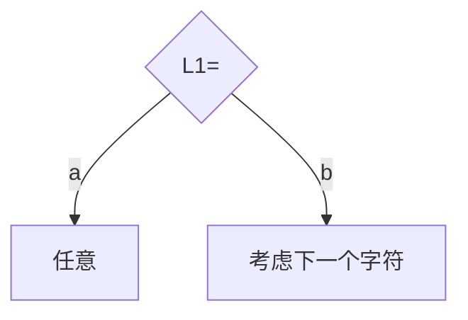
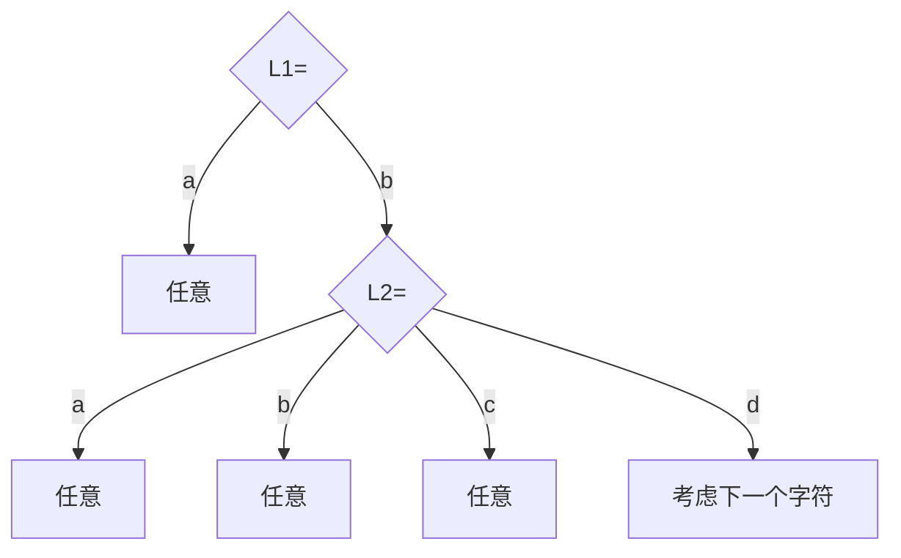

# AcWing-3752：更小的字符串


## 题目描述


#### 输入样例：

```
3
2 3
bc
5 5
abcdd
1 5
d
```

#### 输出样例：

```
Case #1: 2
Case #2: 8
Case #3: 3
```

#### 样例解释

对于样例 1，满足条件的回文串为 `aa`，`bb`。

对于样例 2，满足条件的回文串为 `aaaaa`，`aabaa`，`aacaa`，`aadaa`，`aaeaa`，`ababa`，`abbba`，`abcba`。

对于样例 3，满足条件的回文串为 `a`，`b`，`c`。


## 算法求解

本题是经典的`数位DP`问题，按照题目要求，给定字符串 $S$，需要找的是相同长度、字典序小、前 $k$ 个字母构成的回文字符串。根据数据量，只有 $O(N)$ 的时间复杂度满足要求。

这里所求字符串的**回文**性质其实带来了一定程度的便利——如果已经明确字符串前一半（长度 $\lfloor (N+1)/2 \rfloor$ 或 $\lceil N/2\rceil$ ），那么后一半也就可以明确，如果前一半已经满足字典序要求，只需要确定后一半符合字典序要求，通过一个 $O(N)$ 的遍历检验即可（然而后续论证可以说明这种检验只在一种情况下需要用到）。

两个等长字符串的**字典序**比较有很好的性质——对应位相等，则继续往后比较，直到某一位不相等，可以直接由该位判断两个字符串整体的字典序大小（也就是说和后面的位都无关，后面可以**任意取**）。

解决该问题主要就在于如何确定前一半的序列，`数位统计`中可以通过构建一棵树来进行：

> 假设字符串 $S=bdcae$，$k=5$，所求回文字符串记为 $L$

可以定义字符串一半长为变量 `mid=(n+1)/2`

那么对于 $L$ 的第一个字符 $L_1$，在满足字典序的情况下可以选择 $a$ 或 $b$ ：



- 如果 $L_1=a$，由于 $S_1=b$，故已经满足了字典序的要求，根据字典序比较性质， $L_1$ ~ $L_{mid}$ 可以任意取前 $k$ 小的所有字符的组合（由于回文，最多只能决定到 $mid$ ），所以当 $L_1=a$ 时可能成立的情况有 $k^{mid-1}$ 种。
- 如果 $L_1=b$，那么决定权就给到 $L_2$ 和 $S_2$ 的比较，可以继续构建：



同样，在 $L_2<S_2$ 的情况下，都已经满足了字典序要求，故没种都可以有 $k^{mid-2}$ 种情况，也就是说这里可以取到 $3*k^{mid-2}$ 种情况。

如果归纳到更一般的情况，对于 $L_i$（ $i$ 从1开始 ），共有 `Si-'a'` 种情况会满足“任意”的条件，故可以新增 $(S_i-'a')*k^{mid-i}$ 种成立的情况。如果从 $0$ 开始计数（更符合代码书写的情况），代码表示为：

```c++
res += (LL)(s[i] - 'a') * p[mid - i - 1]		//p[x]表示p的x次方
```

此外，最后还需要考虑前半部分都相等的唯一一种情况（即从1～ $mid$ ），都满足 $L_i = S_i$，那么就需要遍历回文获得的后半部分，检查是否满足字典序，如果满足则需要加上这一种情况。

另外关于 $k$ 的次方运算，可以先通过一个 $O(n)$ 的运算存储在数组 `p` 中，后续只需要调用即可：

```c++
p[0] = 1;
for (int i = 1; i <= n; i++ )
		p[i] = (LL)p[i - 1] * k % MOD;  //k的i次方计算
```

完整代码如下：

```c++
//
//  main.cpp
//  3752-更小的字符串
//
//  Created by MacBook Pro on 2023/8/8.
//

/* 算法：数位统计 */
#include <iostream>
#include <cstring>
#include <algorithm>

using namespace std;

typedef long long LL;

const int N = 100010, MOD = 1e9 + 7;

int n, m;
char s[N];
int p[N];

int main()
{
    int T;
    scanf("%d", &T);
    for (int cases = 1; cases <= T; cases++ )
    {
        scanf("%d%d", &n, &m); scanf("%s", s);

        p[0] = 1;
        for (int i = 1; i <= n; i++ )
            p[i] = (LL)p[i - 1] * m % MOD;  //m的i次方计算

        int res = 0, mid = (n + 1) / 2;     //自由度计算
        for (int i = 0; i < mid; i++ )      //计算每一位 - 非相等情况的自由数
        {
            res += (LL)(s[i] - 'a') * p[mid - i - 1] % MOD; //中间值到本位的最高自由数
            res %= MOD;
        }

        int t = 0;
        for (int i = mid - 1, j = n - 1 - i; i >= 0; i --, j ++ )
            if (s[i] != s[j])
            {
                if (s[i] < s[j]) t = 1;
                break;
            }

        res = (res + t) % MOD;
        
        printf("Case #%d: %d\n", cases, res);
    }

    return 0;
}

```

