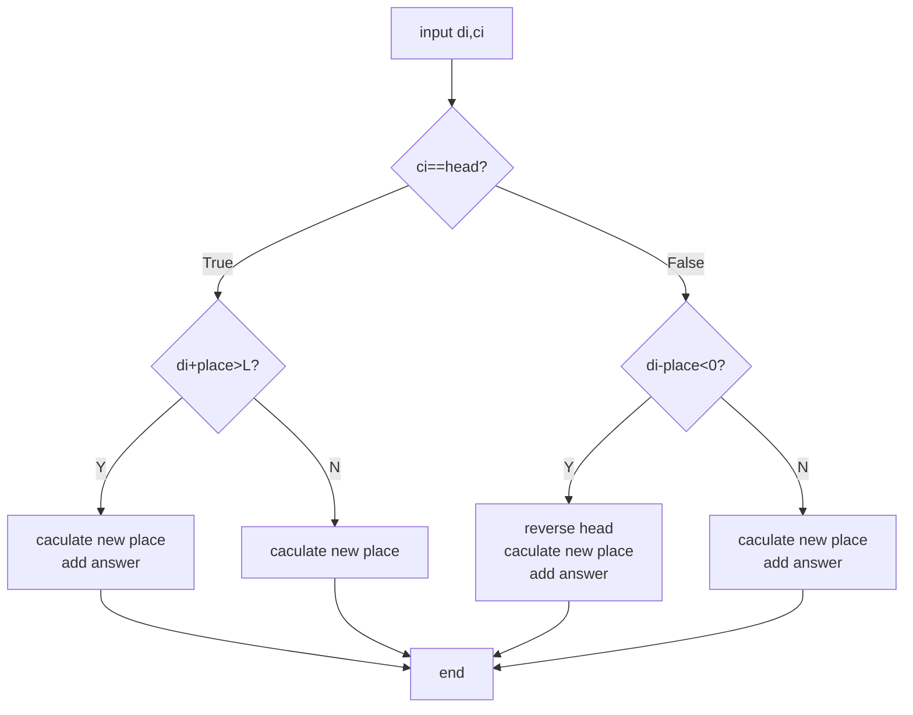

# AcWing-4740：跑圈


该题的思路是`模拟+分类讨论`，每一组数据，设置一个`head`表示上次越过机器时的朝向，`place`表示在当前朝向下相对于起点的相对位置。“当前朝向下”这样处理可以使得place永远为正，且使顺时针和逆时针的处理相同，减少讨论次数。

根据本次方向和`head`是否一致进行分类讨论，每一次讨论继续分为“越界”和“非越界”进行讨论。



⚠️ 注意：数据量使得结果可能超出`INT_MAX`，故使用`long long int`存储结果。


Code：

```c++
//
//  main.cpp
//  4740-跑圈
//
//  Created by MacBook Pro on 2023/7/18.
//

#include <iostream>
using namespace std;

int T,L,N;

//是否是顺时针
bool check(char X){
    return X=='C';
}

int main() {
    scanf("%d",&T);
    for(int index=1;index<=T;index++){
        scanf("%d%d",&N,&L);
        int head=-1;    //面朝方向 1-顺时针 0-逆时针
        int place=0;    //位置
        long long int ans=0;
        for(int i=0;i<L;i++){
            int di;
            char ci;
            cin>>di>>ci;
            if(head==-1){
                head=check(ci);
                ans=(di/N);
                place=di%N;
            }
            else if(head==check(ci)){
                //方向相同
                if(place+di>=N){
                    //需要越过机器
                    ans+=(di-(N-place))/N+1;
                    place=(place+di)%N;
                }
                else{
                    //不越过机器
                    place=(place+di);
                }
            }
            else if(head!=check(ci)){
                //方向不同
                int circle=di-place;
                if(circle<0){
                    //虽然反向但还是在机器后
                    place-=di;
                }
                else{
                    //反向后越过机器
                    head=1-head;
                    ans+=(circle/N);
                    place=circle%N;
                }
            }
        }
        cout<<"Case #"<<index<<": "<<ans<<endl;
    }
}
```

